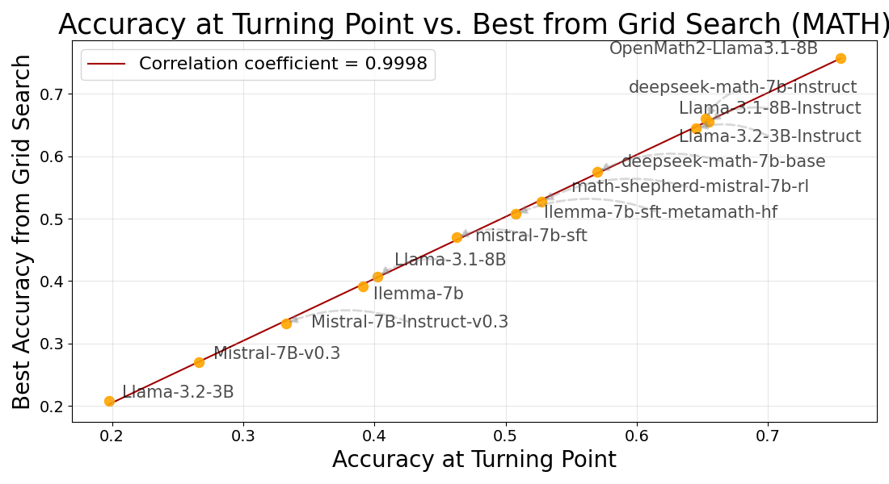

# TURN: Optimizing Temperature for Language Models with Multi-Sample Inference

[](LICENSE)

## Table of Contents
1. [Overview](#overview)
2. [Installation](#installation)
3. [Data & Model Preparation](#data-and-model-preparation)
4. [Usage](#usage)
5. [Reproducing Results](#reproducing-results)
7. [License](#license)
8. [Citation](#citation)
9. [Acknowledgements](#acknowledgements)

---

## Overview

**TURN** is an entropy-based algorithm for **automatic temperature optimization** in multi-sample inference strategies such as *Majority Voting* and *Best-of-N*.

*Multi-sample strategies* achieve state-of-the-art performance but there is little understanding about the role of temerapture in these strategies. TURN provides an automatic temperature selection algorithm.

This repository contains the official implementation of our paper:

> **Weihua Du, Yiming Yang, & Sean Welleck**  
> “Optimizing Temperature for Language Models with Multi-Sample Inference.” (2025)

### Highlights

- **High Correlation**: TURN’s predicted temperature closely matches the best temperature from grid search in terms of accuracy.  
- **No Labels Needed**: The approach is purely entropy-driven, removing reliance on labeled validation sets.

<div align="center">
  
  <p><em>The accuracies between TURN-predicted temperatures and the best grid-search temperatures show high correlation.</em></p>
</div>

---

## Installation

1. **Clone the Repository**:
    ```bash
    git clone https://github.com/StigLidu/TURN.git
    cd TURN
    ```

2. **(Optional) Create a Conda Environment**:
    ```bash
    conda create -n TURN python=3.11
    conda activate TURN
    ```

3. **Install Dependencies**:
    ```bash
    pip install -r requirements.txt
    ```
   > *Note:* For GPU-based inference, ensure the necessary CUDA libraries and drivers are installed.

---

## Data and Model Preparation

Prepare your test data in JSONL format, with **one entry per line**. For instance:

```json
{"problem": "What is 1+1? Provide the answer in detail."}
{"problem": "Explain the concept of derivatives in calculus."}
{"problem": "Prove the Pythagorean theorem."}
```

- Each JSON object must include a `"problem"` key.

Our implementation works with Hugging Face models or local checkpoints.

---

## Usage

Run the main script `predict.py` to automatically infer an optimal temperature for a given **aggregation strategy**:

```bash
python predict.py \
    --model_path [LLM_PATH] \
    --data_path [DATA_PATH] \
    --aggregation_strategy [MJ/BofN] \
    [--num_samples 32 --batch_size 16 ...]
```

### Example

```bash
python predict.py \
    --model_path nvidia/OpenMath2-Llama3.1-8B \
    --data_path data/test_data.jsonl \
    --aggregation_strategy MJ
```

**Output**:
```plaintext
Predicted temperature:  [predicted temperature]
```

### Arguments

- **`--model_path`**: Path to or name of the model (e.g., a Hugging Face model like `nvidia/OpenMath2-Llama3.1-8B`, or a local checkpoint).
- **`--data_path`**: Path to the JSONL file containing the test data.
- **`--aggregation_strategy`**: Currently supports `MJ` (Majority Voting) or `BofN` (Best-of-N).
- **`--num_samples`** (optional): Number of samples to estimate entropy (default: `N=32`).
- **`--batch_size`** (optional): Batch size for inference (default: `16`). Adjust if you face memory constraints.

---

## Reproducing Results

To replicate the experiments reported in our paper:

1. **MBPP (Code Generation)**
   - See instructions in [`CODE/readme.md`](CODE/README.md).  

2. **MATH (Mathematical Reasoning)**
   - See instructions in [`MATH/readme.md`](MATH/README.md).
---

## License

This project is released under the [MIT License](LICENSE).

## Citation

If you find our work useful in your research, please use the following BibTeX reference:

(Coming soon)

## Acknowledgements

We extend our gratitude to the following open-source projects for their foundational contributions:

- [Easy-to-Hard Generation](https://github.com/Edward-Sun/easy-to-hard)
- [bigcode-evaluation-harness](https://github.com/bigcode-project/bigcode-evaluation-harness)
- [vLLM](https://github.com/vllm-project/vllm)

---

## Contact
For any questions or inquiries, please contact:

- Weihua Du: [weihuad@cs.cmu.edu](mailto:weihuad@cs.cmu.edu)
