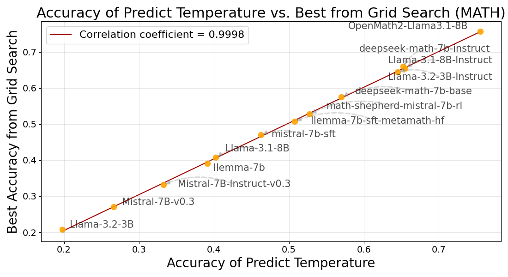

## <em>TURN</em>: Optimizing Temperature for Language Models with Multi-Sample Inference

This repository contains the code for the following paper:

**Weihua Du, Yiming Yang, Sean Welleck: "Optimizing Temperature for Language Models with Multi-Sample Inference"**

### Overview

> The repo contains an entropy-based algorithm, <em>TURN</em>, for automated temperature optimization in multi-sample aggregation strategies, eliminating the need for labeled validation data.
>
> Multi-sample aggregation strategies (i.e., Best-of-N, Majority Voting) are widely used to achieve state-of-the-art performances, and we are the first to provide a systematic analysis for temperature selection in these strategies.
>
> Our predicted temperature has very high correlation to the best temperature from grid search regarding to accuracy (Fig. [1](#image1)).

<a id="image1"></a>
<div style="text-align: center;">

</div>

### Usage

You can use our code for automatic temperature selection. Given a model and a task, TURN algorithm automatically predicts a suitable temperature for multi-sample aggregation strategy.

We support models from Hugging Face or local checkpoints.

#### Step 0: Install Requirements
```bash
conda create -n TURN python=3.11
conda activate TURN
pip install -e requirements.txt
```

#### Step 1: Prepare the Test Data  

Ensure your test data is in JSONL format, structured as follows:  
```json
{"problem": "[problem 1]"}
{"problem": "[problem 2]"}
# Each line is a piece of input ...
{"problem": "[problem K]"}
```

#### Step 2: Run the Inference Script  

Execute the following command to determine the optimal temperature:  
```bash
python predict.py --model_path [LLM_PATH] --data_path [DATA_PATH] --aggregation_strategy [MJ/BofN]
```
This will output a suitable temperature for multi-sample aggregation. We currently support majority voting (MJ) and Best-of-N (BofN). The default setting may takes ~1h to predict the temperature on a A6000 GPU.

> **TODO:** Extend support for additional aggregation strategies.

### Reproducing Results  

To reproduce the results in our paper, refer to the guidelines in:
- `CODE/readme.md` for the MBPP dataset
- `MATH/readme.md` for the MATH dataset

Some additional dependency package may need be installed.

### Acknowledgements  

Our project builds upon *[Easy-to-Hard Generation](https://github.com/Edward-Sun/easy-to-hard)* and *[bigcode-evaluation-harness](https://github.com/bigcode-project/bigcode-evaluation-harness)*.

Special thanks to *[vLLM](https://github.com/vllm-project/vllm)* for its efficient inference infrastructure.